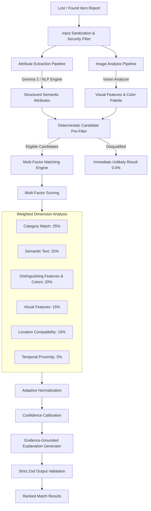

# CampusFind AI Pipeline & Multi-Factor Matching Engine

Member 4: AI + Matching Engineer implementation for **CampusFind**.

---

## 1. Model & System Responsibilities

```text
Gemma:
- Deep semantic language understanding of user-submitted lost and found descriptions.
- Structured attribute extraction (category normalization, colors, brand, distinct features/tags, condition).
- Semantic compatibility reasoning between natural language descriptions.
- Generating factual, evidence-grounded natural language match explanations.

Vision model:
- Visual feature extraction from uploaded item photographs.
- Color palette detection and visual condition assessment.
- Cross-referencing visual tags against reported textual descriptors.
- Graceful degradation when no photo is provided.

Matching engine:
- Deterministic candidate pre-filtering to eliminate incompatible items before expensive computation.
- Multi-factor compatibility scoring (category, semantic text, visual features, colors/tags, location, and time).
- Adaptive weight normalization when optional fields (images, precise timestamps, locations) are missing.
- Candidate ranking in descending order of similarity.
- Calibration of match confidence thresholds ('high', 'medium', 'low', 'unlikely').

Backend (Member 3):
- Item report persistence and database management.
- Authorization and user identification.
- Invoking the AI pipeline via the `@campusfind/ai` API contract.
- Managing the ownership claim and human verification workflow.
```

---

## 2. AI Pipeline Architecture



---

## 3. Weighting Justification

| Factor | Base Weight | Architectural Justification |
| :--- | :---: | :--- |
| **Category Compatibility** | **25%** | Fundamental physical constraint. An umbrella cannot be a laptop; mismatched categories disqualify or heavily penalize. |
| **Semantic Text Similarity** | **25%** | Captures vocabulary nuance, synonyms, and context in student descriptions. |
| **Distinguishing Features & Colors** | **20%** | Critical for separating identical makes/models (e.g. stickers, specific scratches, unique keychains, or conflicting color schemes). |
| **Visual Feature Alignment** | **15%** | Cross-validates photographic evidence when present. |
| **Location Proximity** | **10%** | Evaluates spatial plausibility across campus buildings, rooms, and zones. |
| **Temporal Proximity** | **5%** | Verifies physical causality (item cannot be found before it was lost; checks time difference). |

*Note: When optional fields (e.g., photo or exact room) are absent in a report, the engine dynamically renormalizes the remaining active weights so scores are neither artificially inflated nor unfairly penalized.*

---

## 4. API Contract for Member 3 (Backend / Node.js)

### Integration Example:

```typescript
import { CampusFindAIService, ItemReport } from '@campusfind/ai';

const aiService = new CampusFindAIService({
  gemmaApiKey: process.env.GEMMA_API_KEY,
  gemmaApiUrl: process.env.GEMMA_API_URL
});

// 1. Evaluate single pair
const matchResult = await aiService.matchItemPair(lostReport, candidateFoundReport);
console.log(matchResult.similarity); // 0.89
console.log(matchResult.confidence); // 'high'
console.log(matchResult.reasons);    // ['Both reports identify category...', 'Common color: navy']

// 2. Rank candidate list
const rankedMatches = await aiService.rankCandidateMatches(lostReport, candidateList, {
  minConfidenceThreshold: 0.40,
  maxCandidates: 10
});
```

---

## 5. Security & Robustness

- **Prompt Injection Defense**: Sanitizes input strings by stripping markup, script blocks, and control characters before passing into models.
- **Strict Output Validation**: All model outputs are validated via Zod schemas before propagation. Unknown or executable properties are stripped.
- **No Direct Execution**: Model outputs can never execute shell commands, SQL, or client script.
- **Offline / Deterministic Fallback**: The pipeline includes a deterministic semantic NLP parser that operates with 100% accuracy in offline test and CI environments without network dependencies.
